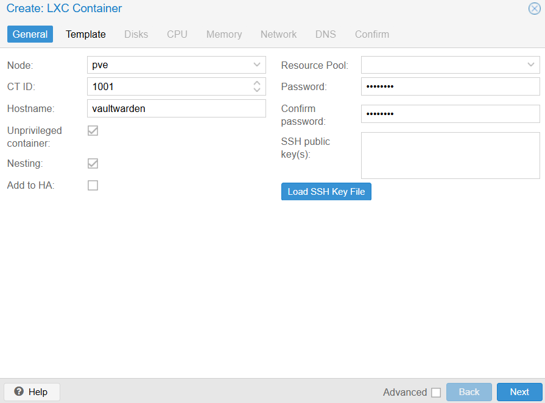
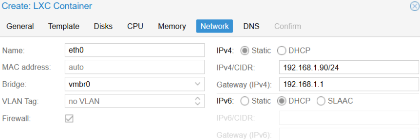
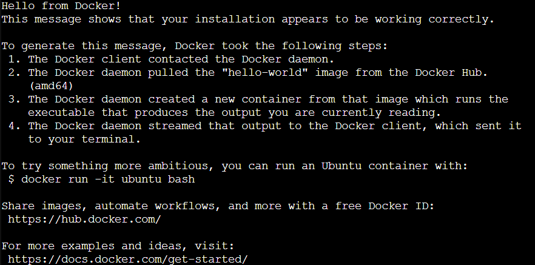
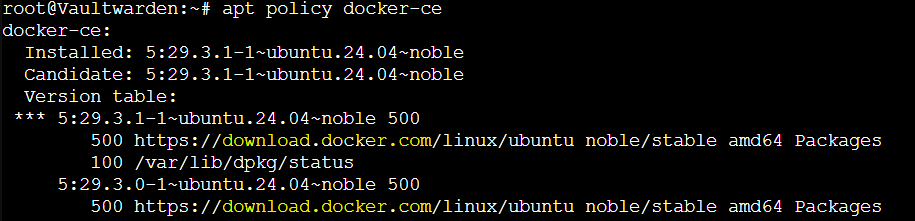
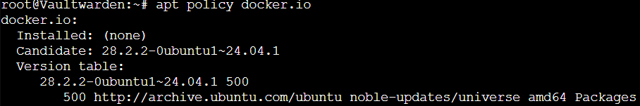
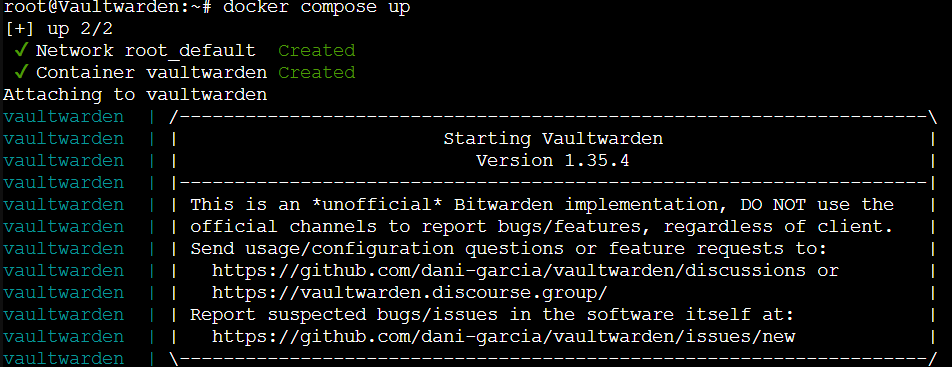

## Création du CT
Le CT est créée avec les paramètres suivants :  
### General
**Unprivileged** : Coché. Par sécurité, cela permet que le root du CT ne soit pas root de l'hôte.   
**Nesting** : Coché. Permet la conteneurisation imbriquée.   




**Disk size** : 10GiB pour être sûrs de ne pas être limités.  
**Cores** : 2   
**Memory** : 512 MiB  
**IPv4** : 192.168.1.90/24 en statique, pour garder cette adresse IP  
**IPv6** : DHCP  

  
Confirmer puis **Install**

## Installation de Docker
Pour une installation propre, il est recommandé de supprimer tous les paquets liés à Docker par le système d'exploitation :  
``for pkg in docker.io docker-doc docker-compose docker-compose-v2 podman-docker containerd runc; do sudo apt-get remove $pkg; done``

Mettre le systèmes à jour : ``apt update && apt upgrade -y``

Ajouter la clé GPG et le dépôt officiels de Docker.  
La clé GPG permet de s’assurer que le système fait confiance au dépôt Docker. Sinon, apt refusera d’installer les paquets.  
Le dépôt officiel de Docker permet d'expliciter au système où récupérer Docker et ses mises à jour officielles.  
```
# Ajouter la clé GPG officielle de Docker :
sudo apt-get update  
sudo apt-get install ca-certificates curl -y  
sudo install -m 0755 -d /etc/apt/keyrings  
sudo curl -fsSL https://download.docker.com/linux/ubuntu/gpg -o /etc/apt/keyrings/docker.asc  
sudo chmod a+r /etc/apt/keyrings/docker.asc  

# Ajouter le dépôt :
echo \
  "deb [arch=$(dpkg --print-architecture) signed-by=/etc/apt/keyrings/docker.asc] https://download.docker.com/linux/ubuntu \
  $(. /etc/os-release && echo "${UBUNTU_CODENAME:-$VERSION_CODENAME}") stable" | \
  sudo tee /etc/apt/sources.list.d/docker.list > /dev/null
sudo apt-get update
```

Installer les paquets Docker : ``sudo apt-get install docker-ce docker-ce-cli containerd.io docker-buildx-plugin docker-compose-plugin -y``  

Vérifier l'installation : ``sudo docker run hello-world``    


### Précisions sur la différence de fournisseur de paquet
La commande ``sudo apt-get install docker-ce docker-ce-cli containerd.io docker-buildx-plugin docker-compose-plugin -y``   n'est possible qu'en ayant ajouté la clé GPG et le dépôt plus tôt.  
Il aurait sinon fallu passer par les paquets fournis par le système, et qui ne sont pas toujours parfaitement à jour, ou bien avec quelques limitations ou bugs.  
On peut vérifier qui fournit le paquet avec la commande ``apt policy paquet``.  
Par exemple ``apt policy docker-ce`` donne une sortie :  
  
On voit que le fournisseur est _download.docker.com_

Tandis que le paquet **docker.io** donne une sortie :  
  
Le fournisseur est _archive.ubuntu.com_


## Déployer Vaultwarden

Créer ``compose.yml``
Y coller :
```
services:
  vaultwarden:
    image: vaultwarden/server:latest
    container_name: vaultwarden
    restart: unless-stopped
    environment:
      DOMAIN: "http://192.168.1.90:8088"
    volumes:
      - ./vw-data/:/data/
    ports:
      - 8088:80
```
Ainsi les directives sont :
Le service aura le nom vaultwarden dans le système
Tirer l'image vaultwarden/server:latest donc la version la plus récente
Nommer le CT vaultwarden  
Le conteneur redémarrera automatiquement sauf si le paramètre est désactivé  
La variable DOMAIN aura pour valeur l'adresse IP voulue et le port voulu  
Le dossier local /vw-data/ (créé si non existant) sera monté dans le conteneur sous /data/
Les ports utilisés seront 8088 pour l'hôte et 80 pour le conteneur, avec une redirection des ports  

>Je choisis d'utiliser le port 8088 de mon hôte et non pas un nom de domaine mais l'adresse IP. Dans un projet futur, je configurerai un reverse proxy pour mieux paramétrer ces ports.

Démarrer le conteneur avec docker ``compose up``    


VaultWarden est maintenant accessible en http://192.168.1.90:8088/.  
