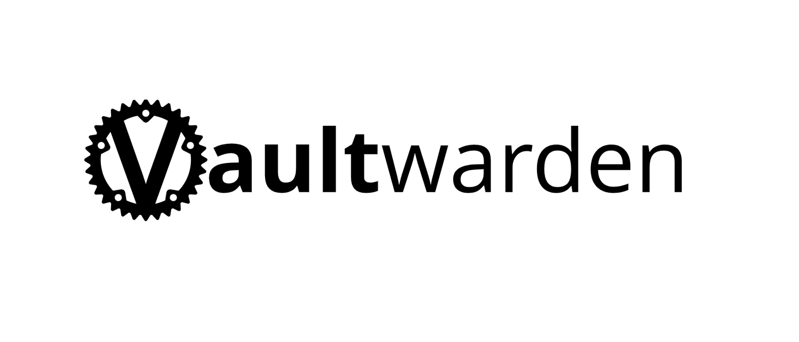

## 🎯 Présentation générale du projet

Ce projet fait partie d’un ensemble de travaux réalisés dans le cadre de la mise en place d’un homelab basé sur Proxmox VE.
Il a pour objectif de documenter la création d’un environnement virtualisé complet permettant de déployer des services auto-hébergés, ici Vaultwarden, via Docker.

Ce projet est destiné à un usage personnel et pédagogique, avec une approche axée sur l'infrastructure et le réseau.

## 🔎 Qu'est ce que Vaultwarden ?

Vaultwarden est un gestionnaire de mot de passe léger et open-source compatible avec Bitwarden permettant de :

- stocker des mots de passe de manière sécurisée  
- synchroniser ses données entre appareils  
- éviter les dépendances aux services cloud tiers  

## 🏗️ Type d'infrastructure

**Version de Proxmox utilisée** : 9.1.4  
**Stockage** : LVM-thin local (local-lvm)  
**Adresse IP** : 192.168.1.90  
**Port** : 8088  
**Stratégie de sauvegarde** : Snapshots avant mise à jour. + Backup hebdomadaire, rétention 4 backup.  

Nous entrerons plus en détail sur les caractéristiques de la VM dans Doc.md  

## 🔄 Améliorations futures

Configurer un reverse proxy pour accéder à Vaultwarden en https

## 📚 Compétences mises en œuvre

Lecture et rédaction de documentation technique

Virtualisation (Proxmox VE)

Réseau (bridge, IP statique)

Déploiement de services auto-hébergé

Troubleshooting

## ❓Q&A

> - Pourquoi utiliser une VM/CT et pas installer directement sur l’hôte ?

Isoler les services est un mesure de sécurité. D'autant plus pour un gestionnaire de mot de passe qui est extrèmement sensible.

> - Pourquoi utiliser Docker ?

L'outil permet de standardiser le déploiement et faciliter la maintenance. Rendant la manipulation plus facile.

 

> - Pourquoi le choix d'un port 8088 ?

Afin d'éviter les conflits avec les services système et simplifier les tests sans reverse proxy. 8088 permet de reconnaitre le port original 80 de http
